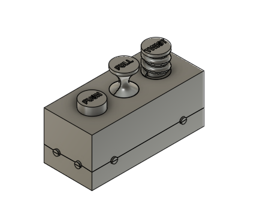

# bop-it game

Game Controller:
- Connect to an Arduino board and use the following pins:
  - 2: button PUSH
  - 3: button PULL
  - 4: button TWIST
- Place buttons in the slotted holes on the game controller case.
- Connect the knobs to the case using elasic bands.
- Close the case and secure using case closing caps

Game Rules:
- The game will start with a random command (PUSH, PULL, or TWIST)
- The player must perform the command within 5 seconds
- If the player performs the command correctly, the game will add a new command
- If the player performs the command incorrectly, the player will lose a life
- The game will end when the player has lost all 3 lives
- The player can restart the game by pressing the RESET button

Isaac Sim